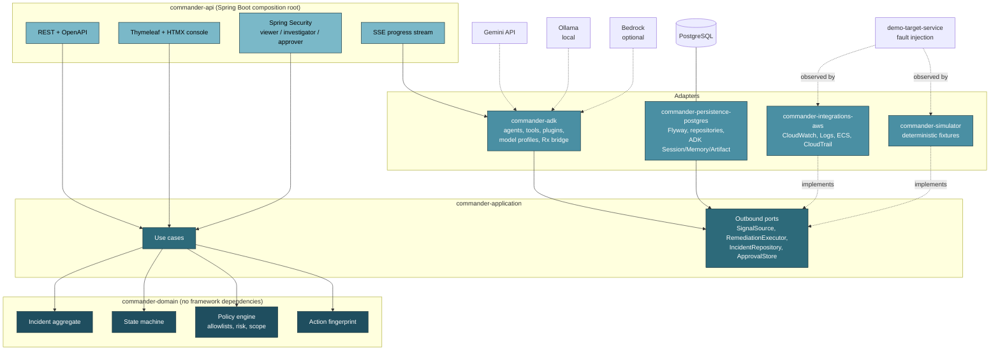
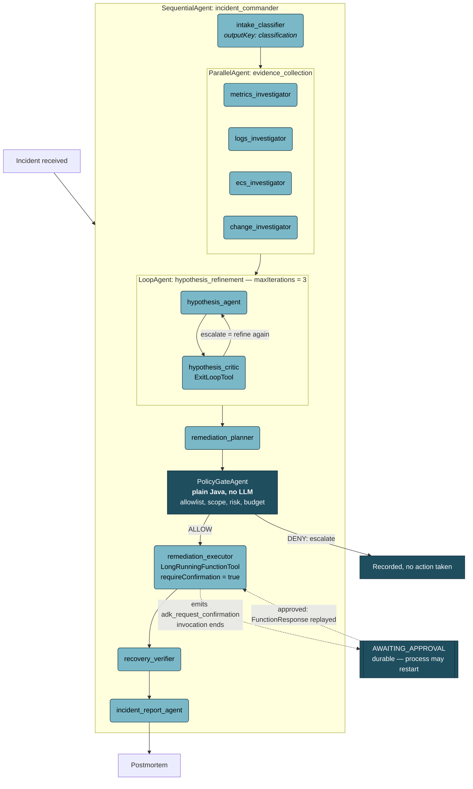
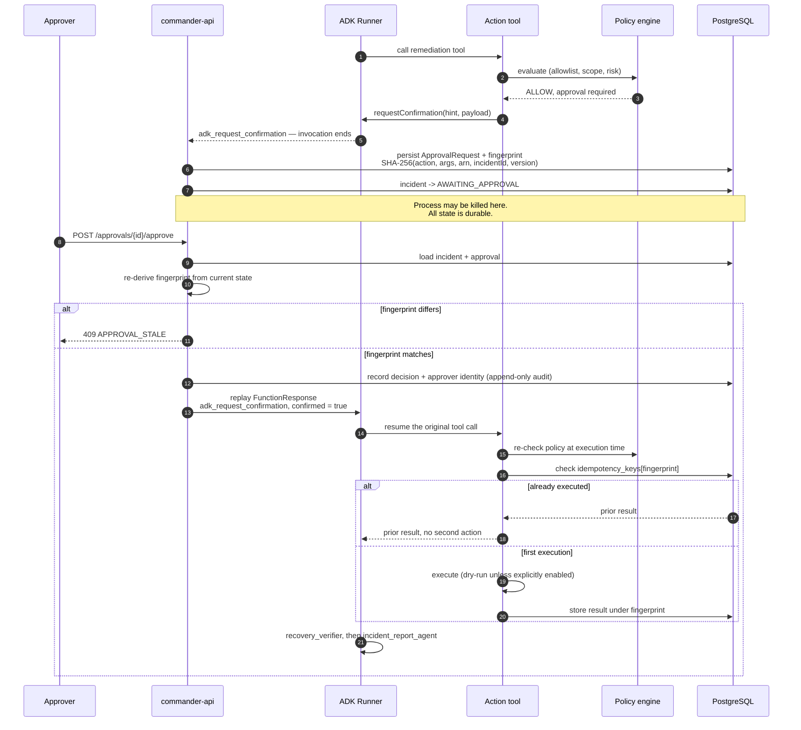
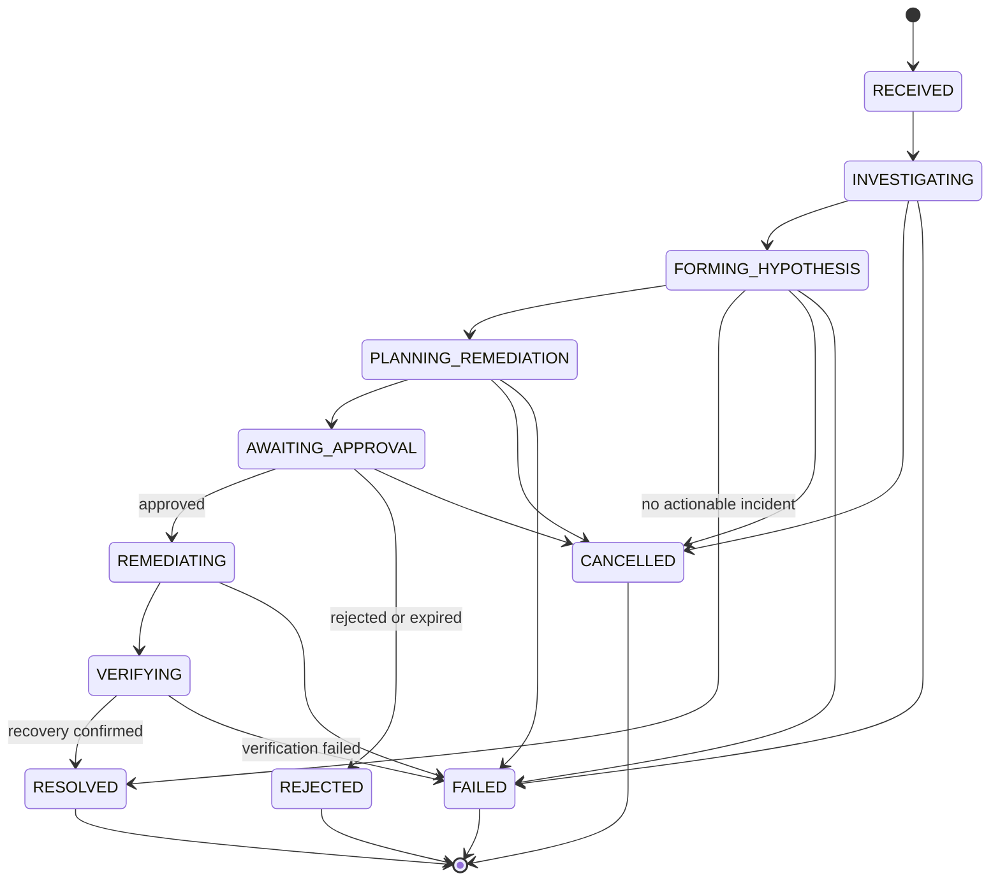
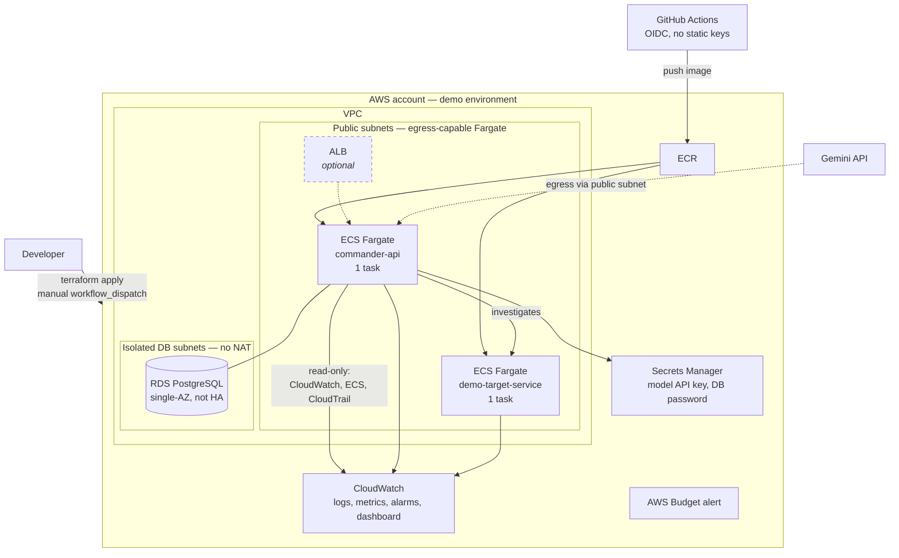

# Architecture diagrams

All diagrams are Mermaid, so they render directly on GitHub and stay diffable in review.

---

## 1. Component view

The dependency rule runs strictly inwards. Each outbound port has two implementations — real AWS and
the deterministic simulator — which is what makes the full demo work with no AWS account.

---

## 2. Agent topology

Deterministic stages are square; LLM stages are rounded. Note that the coordinator and the policy
gate are both plain Java — the model never decides what happens next. See ADR-0003.

---

## 3. Approval sequence, including restart

The load-bearing detail: the policy engine runs **twice** — once at the gate, and again inside the
tool body at execution time. Approval is necessary but never sufficient. See ADR-0007.

---

## 4. Incident state machine

Every transition is explicit; anything absent from this diagram throws. Invalid transitions are
tested exhaustively over all state pairs.

---

## 5. Deployment view

Cost-conscious by default: no NAT Gateway, single-AZ RDS, one task per service, short log retention.
Everything expensive sits behind an `enable_*` variable that defaults to off.

